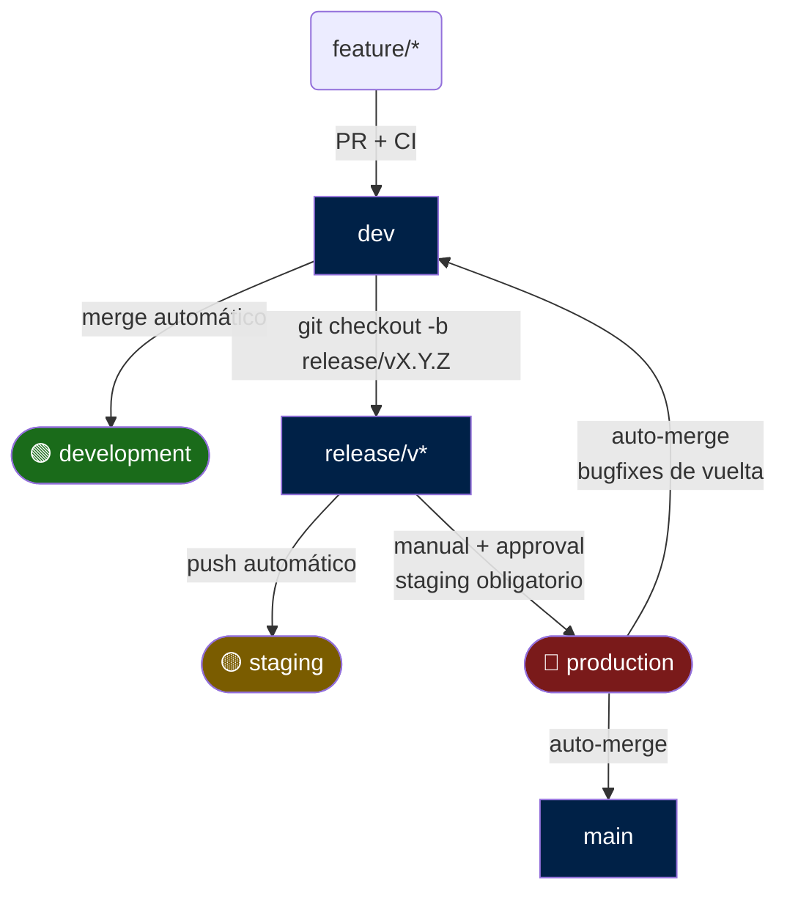
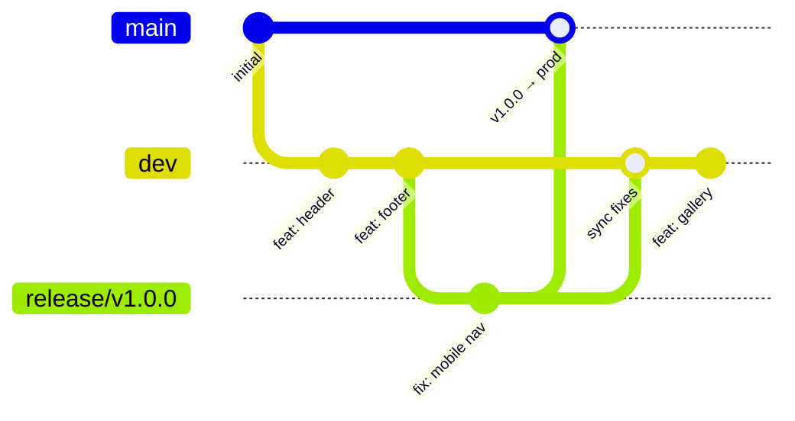
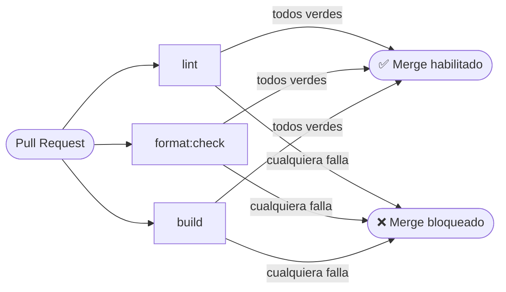
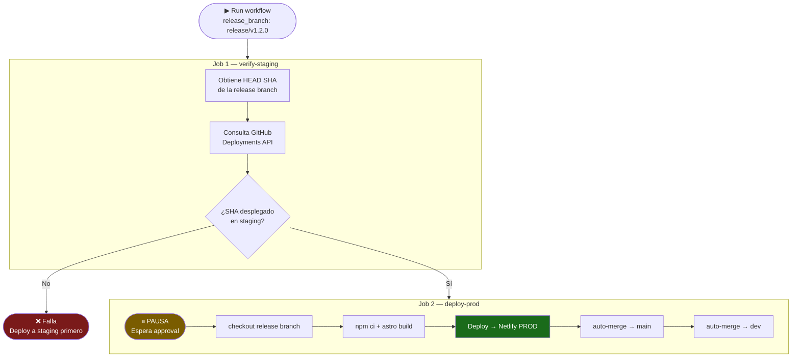

# Flujo de CI/CD — clima-hogar-sv

## Visión general

Todo cambio de código sigue este camino antes de llegar a producción:



Nunca se escribe directamente en `dev`, `release/*` ni `main` — todo entra por Pull Request o por el workflow de producción.

> **¿Qué es una release branch?** Es una rama de corta vida (`release/v1.2.0`) que se corta desde `dev` cuando el equipo decide que hay un conjunto de features listas para salir. En esa rama solo se hacen bugfixes del release. Mientras tanto, `dev` puede seguir recibiendo trabajo nuevo sin afectar el release en curso.

> **Regla de promoción:** el workflow de producción exige que el HEAD de la release branch ya esté desplegado en staging. Si no, falla antes de pedir aprobación.

---

## Ramas

| Rama           | Propósito                                                                             |
| -------------- | ------------------------------------------------------------------------------------- |
| `feature/*`    | Trabajo activo en una funcionalidad o fix. PR → `dev`                                 |
| `dev`          | Rama de integración continua. Recibe todas las features                               |
| `release/v*.*` | Rama de release. Se corta desde `dev`, solo recibe bugfixes del release               |
| `main`         | Espejo exacto de producción — actualizado automáticamente por el bot tras cada deploy |

### Diagrama de ramas



### Reglas de protección

Tanto `dev` como `main` tienen branch protection rules activas:

- **No se puede hacer push directo** — todo debe venir por PR
- **El CI debe pasar** antes de poder mergear (Lint + Format + Build en verde)
- **No se puede borrar** la rama accidentalmente
- **No se permiten force pushes** (reescribir historial)

---

## Ambientes

| Ambiente      | Rama fuente  | ¿Cómo se actualiza?                           | ¿Requiere aprobación? | ¿Requiere staging previo? |
| ------------- | ------------ | --------------------------------------------- | --------------------- | ------------------------- |
| `development` | `dev`        | Automáticamente en cada merge a `dev`         | No                    | No                        |
| `staging`     | `release/v*` | Automáticamente en cada push a `release/*`    | No                    | No                        |
| `production`  | `release/v*` | Manualmente (especificando la release branch) | Sí                    | **Sí — obligatorio**      |

`dev` alimenta development. Las release branches alimentan staging y producción. `main` se actualiza automáticamente como registro histórico después de cada deploy exitoso a producción.

Los ambientes están configurados en: **GitHub repo → Settings → Environments**

---

## Workflows de GitHub Actions

### `ci.yml` — Integración continua

**Se dispara en:** Cualquier Pull Request que apunte a `dev`, `release/**` o `main`.

Corre 3 jobs **en paralelo**, cada uno en una máquina virtual Ubuntu independiente:



#### Job: `lint`

```
1. Checkout del código del PR
2. Setup Node.js (versión definida en .nvmrc)
3. npm ci                  ← instala dependencias exactas del lock file
4. npm run lint            ← ESLint valida .astro, .ts, .js
```

Detecta: variables sin usar, uso de `var` en vez de `const`, patrones problemáticos.

#### Job: `format`

```
1. Checkout del código del PR
2. Setup Node.js
3. npm ci
4. npm run format:check    ← Prettier verifica el formato sin modificar archivos
```

Falla si algún archivo no está formateado correctamente. Solución local: `npm run format`.

#### Job: `build`

```
1. Checkout del código del PR
2. Setup Node.js
3. npm ci
4. npm run build           ← astro build compila el sitio completo
```

Atrapa errores de compilación en `.astro`, importaciones inexistentes, TypeScript inválido.

**Si algún job falla:** El PR queda bloqueado — no se puede mergear hasta que todos estén en verde.
**Si los 3 pasan:** El botón de merge se activa en el PR.

---

### `deploy-dev.yml` — Deploy a Development

**Se dispara en:** Cada push a la rama `dev` (es decir, cada merge de PR).

```
1. Checkout de 'dev'
2. Setup Node.js
3. npm ci
4. astro build             ← genera la carpeta dist/
5. Deploy a Netlify DEV    ← usando NETLIFY_SITE_ID_DEV
   production-deploy: false
```

El build se despliega al sitio Netlify del ambiente de development. Netlify lo registra como deploy de preview (no sobreescribe el slot de producción).

---

### `deploy-staging.yml` — Deploy a Staging

**Se dispara en:** Automáticamente en cada push a cualquier rama `release/*`. También puede dispararse manualmente especificando la release branch.

No requiere aprobación — staging es el ambiente de validación, la velocidad importa aquí.

```
1. Detecta si el trigger es push automático o manual
2. Checkout de la release branch correspondiente
3. Setup Node.js
4. npm ci + astro build
5. Deploy a Netlify STAGING ← usando NETLIFY_SITE_ID_STAGING
   production-deploy: false
```

**¿Cuándo se crea una release branch?**

```bash
git checkout dev
git pull origin dev
git checkout -b release/v1.2.0
git push origin release/v1.2.0
# El push dispara automáticamente el deploy a staging
```

---

### `deploy-prod.yml` — Deploy a Production

**Se dispara en:** Solo manualmente desde **GitHub → Actions → Deploy — Production → Run workflow**. Debes especificar qué release branch deployar (ej. `release/v1.2.0`).



El workflow tiene dos jobs encadenados:

#### Job 1: `verify-staging`

```
1. Lee el HEAD SHA de la release branch especificada
2. Consulta la GitHub Deployments API buscando ese SHA en el ambiente 'staging'
3. Si no existe un deployment exitoso → falla con mensaje descriptivo
4. Si existe → continúa al job de deploy
```

#### Job 2: `deploy-prod` (solo si verify-staging pasa)

```
1. GitHub PAUSA → reviewer recibe notificación
2. Reviewer aprueba en: repo → Actions → workflow en espera → Review deployments
3. Checkout de la release branch
4. Setup Node.js + npm ci + astro build
5. Deploy a Netlify PROD       ← usando NETLIFY_SITE_ID_PROD
   production-deploy: true     ← actualiza el dominio de producción en Netlify
6. Genera token del GitHub App ← clima-hogar-deploy-bot (bypass de branch protection)
7. Auto-merge release → main   ← espejo exacto de lo que está en prod (--no-ff)
8. Auto-merge release → dev    ← trae los bugfixes del release de vuelta a integración (--no-ff)
```

> **Nota:** Los auto-merges usan un **GitHub App dedicado** (`clima-hogar-deploy-bot`) que tiene permisos de bypass en los rulesets de `main` y `dev`. El workflow genera un token efímero del App para autenticarse y poder pushear directamente a ramas protegidas. Los secrets `DEPLOY_APP_ID` y `DEPLOY_APP_PRIVATE_KEY` deben estar configurados en el repositorio (ver sección de Secrets).

---

## Secrets de GitHub Actions

Configurados en: **GitHub repo → Settings → Secrets and variables → Actions**

| Secret                    | Descripción                                                       |
| ------------------------- | ----------------------------------------------------------------- |
| `NETLIFY_AUTH_TOKEN`      | Token personal de acceso a Netlify (User settings → Applications) |
| `NETLIFY_SITE_ID_DEV`     | Site ID del sitio Netlify del ambiente development                |
| `NETLIFY_SITE_ID_STAGING` | Site ID del sitio Netlify del ambiente staging                    |
| `NETLIFY_SITE_ID_PROD`    | Site ID del sitio Netlify del ambiente production                 |
| `DEPLOY_APP_ID`           | App ID del GitHub App `clima-hogar-deploy-bot`                    |
| `DEPLOY_APP_PRIVATE_KEY`  | Llave privada (.pem) del GitHub App para generar tokens efímeros  |

Los secrets nunca aparecen en los logs de los workflows — GitHub los enmascara automáticamente.

---

## El flujo completo día a día

```
# 1. Crear rama desde dev
git checkout dev
git pull origin dev
git checkout -b feature/nombre-feature

# 2. Codear, hacer commits
git add -A
git commit -m "feat: descripción del cambio"

# 3. Subir rama a GitHub
git push origin feature/nombre-feature

# 4. Abrir PR en GitHub: feature/nombre-feature → dev
#    El CI corre automáticamente (lint + format + build)

# 5. CI verde → hacer merge del PR
#    deploy-dev.yml corre automáticamente

# 6. Verificar en el sitio dev de Netlify

# 7. Cuando dev tiene suficientes features para un release:
#    Cortar la release branch
git checkout dev && git pull origin dev
git checkout -b release/v1.2.0
git push origin release/v1.2.0
# → El push dispara deploy-staging.yml automáticamente

# 8. Verificar en staging. Si hay bugs, fixearlos en la release branch:
git checkout release/v1.2.0
# corregir...
git commit -m "fix: descripción del fix"
git push origin release/v1.2.0
# → Staging se actualiza automáticamente con el fix

# 9. Cuando staging está validado, promover a producción:
#    GitHub → Actions → Deploy — Production → Run workflow
#    release_branch: release/v1.2.0
#    → verify-staging pasa ✅ → approval → deploy
#    → auto-merge release/v1.2.0 → main
#    → auto-merge release/v1.2.0 → dev
```

---

## Ciclo de corrección cuando el CI falla

Si el CI reporta un error en el PR:

```
# Ver el error en GitHub (pestaña Checks del PR)
# Corregir localmente en tu rama

git add -A
git commit -m "fix: corregir error de lint/format/build"
git push origin feature/nombre-feature

# El CI corre automáticamente sobre el nuevo commit
# No necesitas cerrar ni reabrir el PR
```

---

## Versión de Node.js

La versión de Node.js está fijada en `.nvmrc` en el root del proyecto.

- **Localmente:** `nvm use` al entrar al proyecto (lee `.nvmrc` automáticamente)
- **En CI/CD:** todos los workflows leen `.nvmrc` via `node-version-file: '.nvmrc'`

Esto garantiza que el entorno local y el de GitHub Actions usan exactamente la misma versión.
